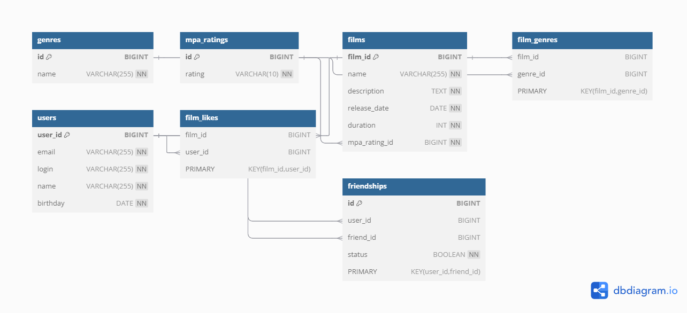

# Filmorate

Это приложение для управления фильмами и пользователями, с возможностью ставить лайки, добавлять фильмы в друзья, а также хранить информацию о жанрах и возрастных рейтингах.

## Диаграмма базы данных

Всю структуру базы данных можно увидеть в диаграмме, доступной по [ссылке на диаграмму](https://dbdiagram.io/d/676bee6f5406798ef79d7b65).

Диаграмма базы данных описывает все сущности, такие как `users`, `films`, `genres`, и связи между ними, включая лайки, дружбы и жанры фильмов.

## Описание схемы

### Сущности:
- **users**: Пользователи приложения, которые могут ставить лайки, добавлять друзей и взаимодействовать с фильмами.
- **films**: Фильмы, которые пользователи могут оценивать, ставить лайки, и на которые могут подписываться жанры.
- **genres**: Жанры фильмов, например, комедия, драма и т.д.
- **friends**: Таблица, описывающая дружбу между пользователями с учетом подтверждения.
- **film_likes**: Таблица лайков, где хранятся все лайки пользователей к фильмам.

### Примеры запросов

#### Добавить пользователя:
```http
POST /users
Content-Type: application/json

{
    "name": "John Doe",
    "email": "johndoe@example.com",
    "login": "johnny",
    "birthday": "1990-05-15"
}
```
#### Добавить фильм:
```http
POST /films
Content-Type: application/json

{
    "name": "The Matrix",
    "description": "A science fiction film",
    "release_date": "1999-03-31",
    "duration": 136,
    "rating": "R"
}
```
#### Добавить лайк:
```http
PUT /films/{filmId}/like/{userId}
```

#### Удалить лайк:
```http
DELETE /films/{filmId}/like/{userId}
```
#### Добавить друга:
```http
PUT /users/{userId}/friends/{friendId}
```

#### Получить список популярных фильмов:
```http
GET /films/popular?count=10
```

PS
тут не все запросы, весь список запросов будет видет в swagger, когда до него дойдут руки